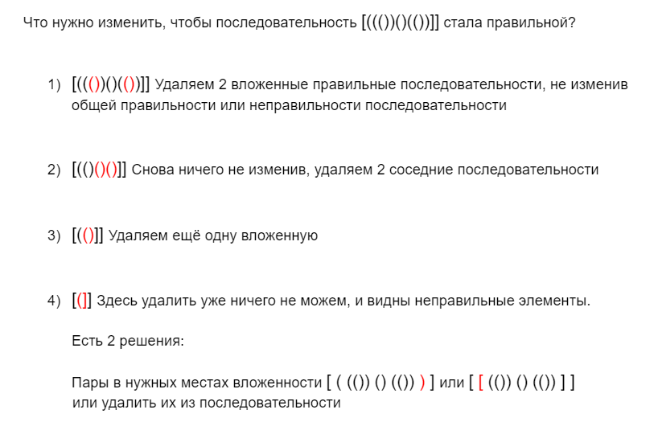
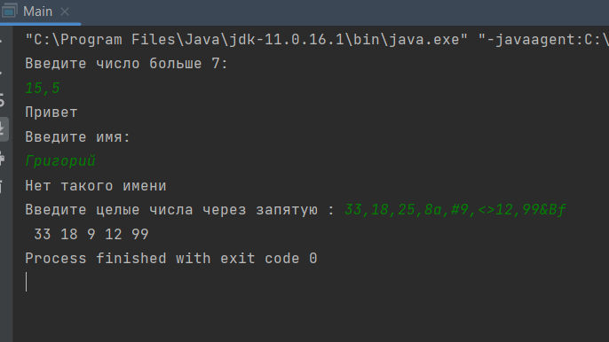
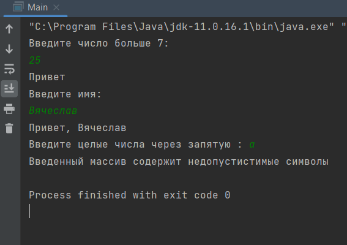

## Тестовое задание на позицию AQA Java Trainee

> - ✓ Задание выполнено на языке программирования Java (11 версия) в среде разработки IntelliJ IDEA.
>
> - ✓ Все 3 задания находятся в папке src/main/java
>
> - ✓ При запуске программы задания выполняются последовательно.
>
> - ✓ Для получения (считывания) данных введенных пользователем используется класс Scanner.
 ___
***Задания, необходимо написать код:***

#### 1) Составить алгоритм: если введенное число больше 7, то вывести “Привет”

#### 2) Составить алгоритм: если введенное имя совпадает с Вячеслав, то вывести “Привет, Вячеслав”, если нет, то вывести "Нет такого имени"

#### 3) Составить алгоритм: на входе есть числовой массив, необходимо вывести элементы массива кратные 3
 ___

***Задание, ответ в текстовой форме:***
#### 4) Дана скобочная последовательность: [((())()(())]]
- Можно ли считать эту последовательность правильной?
- Если ответ на предыдущий вопрос “нет” - то что необходимо в ней изменить, чтоб она стала правильной?

> Пра́вильная ско́бочная после́довательность (ПСП) — символьная последовательность, составленная в алфавите, состоящем из символов, сгруппированных в упорядоченные пары (типы скобок, графически обозначаемые "(" и «)», "[" и «]», «/*» и «*/» и т. п.), удовлетворяющая определённым правилам, обеспечивающим последовательную вложенность подпоследовательностей, обрамлённых открытой и закрытой скобкой одного типа.
>Правильные скобочные последовательности образуют язык Дика и формально определяются следующим образом:
> - пустая строка — правильная скобочная последовательность;
> - правильная скобочная последовательность, взятая в скобки одного типа — правильная скобочная последовательность;
> - правильная скобочная последовательность, к которой приписана слева или справа правильная скобочная последовательность — тоже правильная скобочная последовательность.
> 
>***источник:*** [Wikipedia/Правильная_скобочная_последовательность](https://ru.wikipedia.org/wiki/%D0%9F%D1%80%D0%B0%D0%B2%D0%B8%D0%BB%D1%8C%D0%BD%D0%B0%D1%8F_%D1%81%D0%BA%D0%BE%D0%B1%D0%BE%D1%87%D0%BD%D0%B0%D1%8F_%D0%BF%D0%BE%D1%81%D0%BB%D0%B5%D0%B4%D0%BE%D0%B2%D0%B0%D1%82%D0%B5%D0%BB%D1%8C%D0%BD%D0%BE%D1%81%D1%82%D1%8C)
> 

Нет, данная скобочная последовательность является неправильной.

  
  

 ___

***Скриншоты запуска программы:***

  
  

 

  
  

 